# copy-to-ssh

Paste Windows screenshots into Claude Code or Codex running over SSH.

The problem: Claude Code runs on your server, your clipboard is on your
Windows machine, and Ctrl+V cannot move an image between them. Terminals
only paste text. Screenshot a bug, paste it into a remote session, and you
get nothing, or a local path like
`C:\Users\you\AppData\...\ScreenClip\{guid}.png` that the server cannot
read.

This tool runs in the tray and handles the transfer. When a screenshot is
copied to your clipboard, it uploads it to your SSH host (streamed into
`ssh "cat > file"`, nothing to install on the server) and replaces your
clipboard with the remote path. Claude Code and Codex both treat a pasted
image path as an attachment, so the flow is:

1. `Win+Shift+S` as usual
2. Click the "Screenshot captured" toast, or press `Ctrl+Alt+V`
3. `Ctrl+V` in the SSH window: Windows Terminal, VS Code, Cursor, anything

<p align="center"></p>

## Install

Grab `copy-to-ssh.exe` from the releases page, or build it yourself:

```cmd
build.cmd
```

It compiles with the `csc.exe` included in every Windows install, so there
is no SDK to download. Run the exe and it appears in the tray. Tick
*Start at login* in Settings and it starts with Windows.

The downloaded exe is unsigned, so SmartScreen shows an "unknown publisher"
warning the first time: click "More info", then "Run anyway". To skip the
dialog, install from PowerShell instead:

```powershell
irm https://github.com/thxnlo/copy-to-ssh/releases/latest/download/copy-to-ssh.exe -OutFile "$env:LOCALAPPDATA\copy-to-ssh.exe"
Unblock-File "$env:LOCALAPPDATA\copy-to-ssh.exe"
& "$env:LOCALAPPDATA\copy-to-ssh.exe"
```

Building from source also avoids the warning entirely, since locally
compiled binaries carry no mark of the web.

## Usage

Right-click the tray icon and pick a target under *Send to*. The list is
read live from your `~/.ssh/config`, the same file VS Code and everything
else uses. *Ask before sending* is on by default; untick it and every
screenshot uploads without asking. Double-click the icon for the rest of the
settings: remote dir, start at login.

Details:

- Wait for the "Sent" toast before pasting; with the connection already
  open it appears almost immediately. The app holds one SSH connection to
  the selected host (opened at startup, reopened on demand), so a send is
  just the image bytes over the wire, with no per-send handshake.
- `Ctrl+Alt+V` force-sends whatever image is on the clipboard, from any app.
- Old clips are removed automatically: every upload deletes `clip-*.png`
  older than a day from the remote dir.
- The clipboard watch is event-driven (`WM_CLIPBOARDUPDATE`), not polling,
  so the app idles at zero CPU.
- Config is stored in `%APPDATA%\copy-to-ssh\config.ini` if you prefer
  editing by hand.
- Codex also takes the path as a flag: `codex -i <path> "..."`.

## Requirements

Windows 10 or 11 with its built-in OpenSSH client, and key-based auth to
the target. A password prompt on every upload would break the flow.

## Limitations

Uploads go to whichever host is selected in the tray. If you SSH into
several machines or containers, pick the one your Claude Code session
actually runs on; the file must end up on a filesystem that session can
read.
